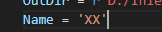
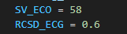
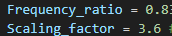
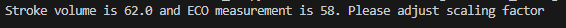

# Waveform_tuning
This code is to tune a generic waveform to match patient-specific information. Currently, it is tuned to match T (caridiac period, stroke volume, and the ratio of cardiac systole and diastole period). Please refer to the literature:

## FlatWaveform.py
1. Change the varibale **Name** to the filename you want to save as
 
1.  **SV_ECO** and **RCSD_ECG** is replaced with patient-specific values. Here SV is currently estimated from ECO, and RCSD (ratio of cardiac systole and diastole period) is measured from ECG. They can be estimated from other ways as long as it is accurate.
     
2. Run and following the instructions to adjust **Frequency_ratio** and **Scaling_factor** untill both SV and RCSD being matched
 
For example:

4. After tuning, it will output 4 files:
   1. **xx_coefficient.xlsx**: Fourier coefficients for the new waveform.
   2. **xx_coefficient_CFX.csv**: Formatted into the form for CFX expressions. Copy and paste into CFX pre
   3. **xx_flowrate.csv**: Flowrate
   4. **xx_mean_flowrate.csv**: Mean flowrate, which is needed for 3-element Windkessel tuning.